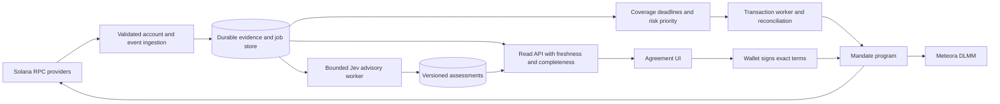

# Mandate: code, architecture, and reliability review

Reviewed 2026-09-26 at `e607bc4387cbc9b4e8418eff151de4b4a5125cdd`. Scope: current Anchor program, SDK, keeper and Jev integration, RPC proxy, app data/actions, recent verification tooling, and test coverage. Particular attention to commits `776c67e`, `a6d0256`, and `e607bc4`.

**Verdict: retain the core design, but request changes before real-value pilots.** Deterministic enforcement and constrained inventory custody are the right foundations. Reference integrity, recovery, evidence provenance, and observation reliability need correction. The existing tests cover successful contract lifecycles considerably better than production failure paths.

Only review documents and reproduction scripts were added. No production code, deployed program, credentials, or external service configuration was changed. These findings concern the local checkout; deployed-bytecode equivalence was not checked.

## Evidence and verification

| Check | Result |
|---|---|
| `npm run test:unit` | 20 Rust tests pass |
| `npx tsc --noEmit -p tsconfig.check.json` | Pass |
| `npm test` | 40 tests pass, including after a fresh program build |
| `npm --prefix app run build` | Pass; devnet burner-wallet and native bigint fallback warnings |
| `npm run build` | Exit 0 and artifacts produced, **but SBF stack-limit diagnostics and unresolved-symbol warnings are emitted** |
| Review probes | Local LiteSVM and mocked-transport reproductions; see the three scripts and JSON outputs below |

- [Core/keeper/model probes](/Users/anurag1104/Desktop/mandate/docs/reviews/robustness-probes.ts), [results](/Users/anurag1104/Desktop/mandate/docs/reviews/robustness-probes.json).
- [RPC probes](/Users/anurag1104/Desktop/mandate/docs/reviews/rpc-probes.ts), [results](/Users/anurag1104/Desktop/mandate/docs/reviews/rpc-probes.json).
- [Oracle boundary probe](/Users/anurag1104/Desktop/mandate/docs/reviews/oracle-boundary-probe.ts), [results](/Users/anurag1104/Desktop/mandate/docs/reviews/oracle-boundary-probe.json).
- [Program build diagnostics](/Users/anurag1104/Desktop/mandate/docs/reviews/program-build.log).

Run each script with `npx tsx docs/reviews/<script>.ts` from the repository root. They assert the defective behavior at this commit; they are review witnesses, not passing regression tests for a corrected implementation. They never send live transactions or call a live model. The only API credential in their mock output is the literal `REVIEW_DUMMY`.

## Prioritized code findings

### R1 — P1: same-second oracle samples bypass the taint protection

Location: [anchor.rs:42](/Users/anurag1104/Desktop/mandate/programs/mandate/src/anchor.rs:42); the SDK repeats the boundary rule in `observe()`.

`start_ts`, `next_ts`, and the incoming sample are discarded only when strictly less than `taint_ts`. A sample taken before a liquidity removal in the same Unix second remains usable as the beginning of a supposedly clean window.

**Reproduced against the local program and Meteora binary:** establish an oracle sample at `1758000400`, remove active-bin liquidity at that timestamp, wait 600 seconds, jump to bin 200 with `go_to_a_bin`, and swap. DLMM attributes the interval to bin 200. Mandate accepts it: target becomes 200 and reference moves from 0 to 4. Existing tests taint after the last sample and miss this equality case.

The speed limiter still bounds movement; this is a demonstrated protection bypass, not a demonstrated full vault-drain exploit.

**Change:** invalidate all saved endpoints at or before a taint, reject incoming samples at or before it, and use the first strictly later sample only as a fresh baseline. Require a full subsequent clean window. Consider an explicit reference-quality state so callers can distinguish warming, tainted, stale, and ready. Mirror the rule in the SDK. Add tests for same transaction, same second across transactions, repeated taints, stale samples, and delayed first post-taint trades.

### R2 — P1: keyed RPC URLs can be returned to unauthenticated clients

Locations: [rpc.ts:24](/Users/anurag1104/Desktop/mandate/sdk/src/rpc.ts:24), [route.ts:108](/Users/anurag1104/Desktop/mandate/app/src/app/api/rpc/route.ts:108).

Failover errors contain the full upstream URL. The proxy interpolates that error into its public JSON response. With a keyed provider as the final failing endpoint, the query-string credential is exposed.

**Reproduced:** a mocked 503 from `https://rpc.invalid/?api-key=REVIEW_DUMMY` resulted in HTTP 502 containing that dummy key. No real credential or production endpoint was tested.

**Change:** identify endpoints by a safe label; redact query strings, userinfo, and sensitive headers at the transport boundary. Return a generic public error with a correlation ID. Apply redaction to keeper logs too. Add per-client/global RPC quotas, bounded request cost, and concurrency limits; the current method allowlist still exposes broad transaction simulation/submission and arbitrary account reads through the service's upstream budget.

### R3 — P1: cancellation or terminal state can strand router tokens

Location: [router.rs:59](/Users/anurag1104/Desktop/mandate/programs/mandate/src/instructions/router.rs:59).

The one-time `(router, mint)` mapping cannot be replaced, while `route_leftover` requires Open or Active status. If cancellation happens before routing, or DBC leftovers arrive after expiry/settlement, no instruction releases those router-held tokens.

**Reproduced:** register a launch, fund its router ATA, cancel the mandate, then route. It fails with `InvalidStatus`; 1,000,000 token atoms remain in the router. Arrival by DBC instead of the fixture mint would encounter the same status gate.

**Change:** record an immutable beneficiary and allow permissionless terminal recovery to that beneficiary's validated token account. Routing into a terminal vault is insufficient unless that vault also has a safe recovery path. Keep redirection rights constrained; simply giving the launchpad unrestricted rescue authority would change the custody promise. Test both transaction orderings and every terminal state.

### R4 — P1: any snapshot caller can impersonate a Jev assessment

Locations: [feed.ts:70](/Users/anurag1104/Desktop/mandate/app/src/lib/feed.ts:70), [sentinel.ts:53](/Users/anurag1104/Desktop/mandate/sdk/src/sentinel.ts:53).

Snapshots are correctly permissionless, but the UI accepts the first matching memo and presents its claimed model name. Neither publisher authority nor an association with a specific mandate/measurement is verified. One memo is attached to all snapshot events in a transaction.

**Reproduced:** a local snapshot transaction carried a fabricated `m=jev-1.13.0+rules` memo with 99% breach/exit values; the parser accepted it, with no model call.

**Change:** keep permissionless measurements, but authenticate assessments separately. Bind a signed envelope to cluster genesis hash, mandate, measurement signature/slot, input hash, assessed-at time, expiry, policy version, and model version. Show the publisher identity and only grant a trusted-provider label to approved signers. A trusted signature proves who published the assertion; it does not cryptographically prove that Jev ran. Label other memos as unverified third-party commentary.

### R5 — P1: the watcher exceeds the RPC account limit at 34 active agreements

Location: [watchtower.ts:194](/Users/anurag1104/Desktop/mandate/keeper/watchtower.ts:194).

The watcher requests three accounts per active mandate in one RPC call. At 34 mandates it requests 102 accounts, exceeding the [documented maximum of 100](https://solana.com/docs/rpc/http/getmultipleaccounts). This fails before checking or settling any mandate. The all-mandate refresh and board/log/metadata loaders contain similar unchunked requests; closed mandates remain in discovery.

**Reproduced with a mock enforcing the official limit:** 34 Active entries result in a 102-account call and rejected tick.

**Change:** centralize chunked account loading (at most 100), deduplicate shared mint/profile/pair keys, bound concurrency, and attach slot context. Separate discovery from active work, and filter terminal accounts out of the frequent polling path. Test 0, 1, 33, 34, 100, and 101 mandates, missing accounts, and one failing chunk.

### R6 — P1: Jev and activity retrieval block time-critical checks

Location: [watchtower.ts:223](/Users/anurag1104/Desktop/mandate/keeper/watchtower.ts:223), [watchtower.ts:253](/Users/anurag1104/Desktop/mandate/keeper/watchtower.ts:253).

Every mandate's activity is fetched serially, then each due mandate awaits `judge()` before submitting its check. A model call can wait ten seconds; multiple slow calls can consume entire one-minute periods. Transaction confirmations are also serialized. The rules-only fallback occurs after the delay, so advisory AI availability still affects enforcement liveness.

**Evidence:** traced control flow and configured timeout; no live outage injection was performed. This is separate from whether Jev is usually fast.

**Change:** run deterministic observation/submission on its own deadline-driven worker. Publish model assessments asynchronously against already-confirmed measurements. Use a bounded model queue, per-request timeout, circuit breaker, input-hash deduplication, and explicit stale/absent states. A model timeout must not delay a check by its timeout duration. Test this with a deliberately hung mock provider while asserting check deadlines.

### R7 — P2: catch-up batches roll back when an early call breaches

Locations: [watchtower.ts:209](/Users/anurag1104/Desktop/mandate/keeper/watchtower.ts:209), [score.rs:227](/Users/anurag1104/Desktop/mandate/programs/mandate/src/instructions/score.rs:227).

The keeper batches up to six finalizations. If the first instruction changes Active to Breached, the second rejects `InvalidStatus`, rolling back the entire transaction, including the slash. The batching count assumes processing capacity, not a possible early terminal transition.

**Reproduced:** with a failing current period and a 40-period backlog, two finalizes fail and leave the account Active at its original period. One finalize succeeds and breaches. A later single snapshot/finalize can still recover; this is not permanent protocol-level lockup, but it breaks the intended recovery path.

**Change:** make finalization explicitly idempotent for appropriate terminal states, or finalize once, re-read, and continue only while Active. Re-filter the live worklist after transitions. Test breach in the first/middle batch instruction, expiry, competing keepers, and compute/log limits for large batches.

### R8 — P2: transient null transaction responses become permanent missing evidence

Locations: [route.ts:55](/Users/anurag1104/Desktop/mandate/app/src/app/api/rpc/route.ts:55), [feed.ts:67](/Users/anurag1104/Desktop/mandate/app/src/lib/feed.ts:67), [watchtower.ts:93](/Users/anurag1104/Desktop/mandate/keeper/watchtower.ts:93).

The proxy caches any non-error HTTP 200 response, including `getTransaction: null`, for an hour. The feed and watcher also mark a null transaction seen and advance their cursor. A null response may mean the transaction is not yet available at the requested commitment; [Solana documents that null result](https://solana.com/docs/rpc/http/gettransaction).

**Reproduced:** a null first response remained cached after the mock upstream began serving the transaction; only one upstream request occurred. Separately, the watcher's null read marked the signature seen and advanced the cursor.

**Change:** never long-cache null transactions. Distinguish found, pending/unavailable, failed, and unsupported. Persist unresolved signatures and retry with a bounded reconciliation policy; do not claim complete history through an unresolved gap.

### R9 — P2: activity ingestion drops backlog and misattributes other mandates

Location: [watchtower.ts:89](/Users/anurag1104/Desktop/mandate/keeper/watchtower.ts:89), [feed.ts:60](/Users/anurag1104/Desktop/mandate/app/src/lib/feed.ts:60).

Readers fetch only the newest 25/30 signatures and advance to the newest returned signature without paginating to the previous cursor. More activity between polls silently loses the middle. The watcher also assumes account zero (fee payer) is the maker, excluding sponsored/multisig actions, and processes every parsed event without checking `d.mandate`. A transaction involving two mandates can attribute a withdrawal on B to A.

**Reproduced:** the watcher attributed a B withdrawal to A using a mocked parsed event. Pagination loss and fee-payer exclusion are code-path findings.

**Change:** paginate using `before` until the saved cursor is reached; persist `(signature, event index)` identities and progress. Validate the emitting program, transaction success, and event mandate; use validated instruction accounts/authority evidence instead of assuming fee payer equals actor. Mark incomplete history as unknown, not “the maker has not placed or removed liquidity yet.” Bound or replace the growing `seen` sets.

### R10 — P2: Jev can receive false facts and publish stale or invalid outputs

Locations: [sentinel.ts:79](/Users/anurag1104/Desktop/mandate/keeper/sentinel.ts:79), [watchtower.ts:161](/Users/anurag1104/Desktop/mandate/keeper/watchtower.ts:161), [systemone.ts:66](/Users/anurag1104/Desktop/mandate/sdk/src/systemone.ts:66).

Three independent defects:

- Setup is compared with `periodSecs`, although the contract grace is exactly 60 seconds. Rules use `2 * periodSecs` for one not-started path. With an hourly period, a maker ten minutes late is described as still inside a one-minute setup window.
- On model failure, a cached assessment is reused without a maximum age or matching input hash. It receives a new memo timestamp, masking the actual assessment age.
- Response validation checks only that answer keys exist. Wrong primitive types, out-of-range probabilities, invalid diagnoses, and malformed confidence values are accepted.

**Reproduced:** 600-second age described as setup; a 100,000-second-old 1% breach prediction republished beside a current withdrawal diagnosis; probability `17` accepted by `decide()`.

**Change:** share contract timing constants, preserve `assessedAt` and `observedSlot`, expire changed-input results, and fall back to rules/unknown explicitly. Validate the complete runtime schema, finite probabilities in [0,1], allowed choices, distribution shape, and model ID. The actual TypeSafe endpoint and answer shapes match the [official API](https://docs.typesafe.ai/api); the missing piece is consumer-side validation and provenance.

### R11 — P2: the pilot verifier's default reference usually has only one observation

Locations: [verify.ts:71](/Users/anurag1104/Desktop/mandate/scripts/verify.ts:71), [verify.ts:172](/Users/anurag1104/Desktop/mandate/scripts/verify.ts:172).

The reference is a median of samples from five minutes, while defaults schedule three samples per hour with gaps uniformly up to 40 minutes. In the idealized scheduler, 87.5% of gaps exceed five minutes; then all earlier samples are discarded and the “median” is just the current spot bin. There is no warm-up or coverage gate. This does not inherit the contract's TWAP protection.

The explicit `--position` path also does not verify the supplied position's pair/owner; wider positions are scored from only their first 70 bins. Missing arrays are skipped. These incomplete reads can become definitive “missed” outcomes.

**Change:** use validated oracle cumulative observations with declared readiness/freshness, or maintain a separately sampled, adequately covered reference series. Validate account owner/discriminator/pair/operator, support extended layouts or return unsupported, and distinguish incomplete evidence from noncompliance. Recompute the period from the actual observation time after RPC reads. Persist raw account evidence with slots and all reference/scoring parameters.

### R12 — P2: off-chain compliance is not an exact mirror of on-chain arithmetic

Locations: [measure.ts:39](/Users/anurag1104/Desktop/mandate/sdk/src/measure.ts:39), [chain.ts:260](/Users/anurag1104/Desktop/mandate/app/src/lib/chain.ts:260), [scoring.rs:79](/Users/anurag1104/Desktop/mandate/programs/mandate/src/scoring.rs:79).

Rust values a bin in integer fixed-point, adds both sides, then applies the ownership share. The app/verifier first floor each token's ownership share independently and then value UI-unit floating-point amounts. The SDK also omits Rust's one-atom minimum for spread-at-size.

Arithmetic counterexample: at a near-unit bin price, X=1 atom, Y=3 atoms, share=1/2. Rust can yield 2 quote atoms after aggregate valuation; flooring the token shares first gives X=0, Y=1, i.e. 1 atom. At a threshold this changes a pass to a fail. Floating-point price and u64 precision create further boundary disagreement.

**Change:** expose a canonical raw-account BigInt measurement implementation, preserving Rust operation order, rounding, saturation, and missing-account behavior. Convert to UI units only for presentation. Use differential fixtures against Rust/LiteSVM across decimal counts, negative bins, fractional shares, dust, maxima, and exact thresholds. Keep executable quotes explicitly separate estimates.

### R13 — P2: decimals and currencies are assumed in shared monitoring/summary code

Locations: [watchtower.ts:122](/Users/anurag1104/Desktop/mandate/keeper/watchtower.ts:122), [loaders.ts:107](/Users/anurag1104/Desktop/mandate/app/src/lib/loaders.ts:107), [sla.ts:24](/Users/anurag1104/Desktop/mandate/app/src/lib/sla.ts:24).

The contract permits classic SPL quote mints, but the watcher defaults all values to six decimals/USDC, board totals sum them as one currency, and some SLA descriptions use six decimals despite the detail page loading actual decimals. A nine-decimal quote amount is displayed 1,000x too large in those paths. Summing unlike quote tokens is invalid even when decimals coincide. `MakerProfile.fees_earned` and `bond_slashed` also aggregate raw amounts from potentially different quote mints.

**Change:** carry mint identity and decimals in every monetary value. For the first robust release, explicitly restrict supported quote mints or group all totals by quote mint. Version per-mint profile aggregates. Do not silently substitute six decimals when mint data is unavailable.

### R14 — P2: route changes can retain and overwrite the new page with old agreement data

Location: [hooks.ts:18](/Users/anurag1104/Desktop/mandate/app/src/lib/hooks.ts:18).

The polling hook retains data/in-flight state across dependency changes and has no request generation check. If the component is reused for another mandate, its initial new reload may be skipped while the old request is active; the old response can then set data under the new URL. Existing data is also retained when the new load fails. This was established from the hook and route composition; no interactive browser reproduction was performed.

**Change:** key data by cluster/account and ignore obsolete request generations; reset state on identity change and cancel requests where supported. A keyed detail component helps, but the generic hook should be correct. Keep stale data only for the same resource. Test a slow A response, navigation to B, B failure, and completion of A.

## Architecture assessment

### What should remain

- On-chain scoring, payments, and slashing do not use Jev. Preserve that boundary.
- Vaults and DLMM positions are owned by the mandate PDA; normal withdrawals return to fixed vaults. Settlement recipients are constrained on-chain.
- A caller cannot alter immutable agreement terms after acceptance.
- Committed value and executable liquidity are now shown separately. Preserve the distinction throughout data contracts, copy, and evaluation.
- Bounded finalization and permissionless unwinding are useful primitives, provided recovery is idempotent.
- LiteSVM tests using real Meteora binaries are valuable integration evidence. They do not prove all deployment, RPC, network, or adversarial behavior.

### The main weakness: observation and evidence are treated as incidental infrastructure

The contract can only pay or fail periods that get observed. Therefore ingestion, scheduling, funding, transaction delivery, and recovery are part of the product's economic mechanism. An accurate model does not compensate for a missing check. A publicly readable memo does not prove its stated author or model.

Use four explicit boundaries: contract enforcement, reliable observation, advisory analysis, and presentation. Start with a modular TypeScript service and a durable database, with a separate model worker. These can share one repository and deployment host initially; their queues and failure budgets must be independent.

### Data contracts

Use explicit types instead of `any` for decoded Mandate, Terms, Measurement, and event variants. Store money as integer strings/BigInt plus mint identity. Version the IDL, reference policy, scoring policy, and assessment policy.

Suggested durable records:

| Record | Identity and required evidence |
|---|---|
| Agreement | Cluster genesis + program version + mandate address; immutable terms hash |
| Chain event | Signature + event index; slot, block time, commitment, emitting program, mandate |
| Observation | Mandate + source slot/signature; raw account hashes, oracle quality, committed result, execution estimate, completeness |
| Keeper job | Mandate + action + expected period/state; deadline, attempts, lease, transaction signature, observed outcome |
| Assessment | Observation hash + policy/model version; publisher, assessed-at, expires-at, validated values, fallback reason |

Persist cursors and unresolved transactions. Reconcile confirmed records against finalized state; mark orphaned data rather than silently using it as permanent reputation. Avoid using a cache timestamp as the observation timestamp.

### Transaction delivery and concurrency

`sendAndConfirm()` re-signs the same instruction set after an RPC reports blockhash expiry without first reconciling whether the old signature landed. With failover, an endpoint serving statuses can lag one serving block heights. For non-idempotent deposits/trades/adds, replaying intent under a new signature can execute twice. This is a code-path risk; duplicate execution was not reproduced in this review.

Persist the signature before waiting. Resend the same signed bytes while valid; on ambiguity, query historical signature status and inspect action postconditions before deciding to rebuild. Use an explicit UnknownOutcome state instead of blindly retrying. Put deadlines on confirmation loops; chain stalls must not block every other agreement. Never parallelize conflicting writes to the same mandate blindly. Profile and shared pool account locks also constrain useful concurrency.

Keep transaction reads separate from dashboard caches. Refresh exact agreement state before signing, simulate, and reconcile the confirmed transaction. The current shared browser transport can serve account data up to 90 seconds old without communicating that age to wallet action code.

### Scheduling and capacity

The current scheduler sorts by risk until the budget is consumed. Random scheduling alone does not enforce the claimed coverage floor: persistent high-risk work can repeatedly take the budget. Admission control and an aging/deadline policy are needed.

Define a minimum per-period observation budget before admitting monitored agreements, then allocate spare checks by risk. Track observation coverage, age of oldest due job, period-finalization lag, transaction failure/unknown rate, settlement delay, RPC latency, and model queue age independently.

Capacity is approximately `agreements * samplesPerPeriod / periodMinutes` successful checks per minute, plus finalization, discovery, retries, and settlement. For 100 one-minute agreements at three samples per period, the check workload alone is 300/minute. A serial worker waiting at least 1.5 seconds for each confirmation cannot sustain that. This is an illustrative sizing calculation, not a benchmark.

Suggested pilot objectives: at least 99% of enrolled periods observed; bounded oldest-due age per agreed monitoring policy; settlement jobs scheduled promptly after terminal state; no model-induced checking delay; all reported assessment provenance verifiable. Record unmet objectives visibly; monitoring outages must not appear as healthy service.

## Jev-specific design changes

The request endpoint and primitive shapes align with the official API. The problems are the facts supplied, operational coupling, and the meaning assigned to outputs.

1. **Reason about facts you actually measure.** Current inputs come from committed bin value, but `side_depleted_by_trading` and generated evaluation cases treat a trade as reducing committed ask depth while increasing committed bid depth. At a fixed reference, the contract is designed to prevent that change. Separate committed depth, executable token composition, reference movement, and verified maker actions. A diagnosis about execution depletion requires execution evidence.
2. **Assess after recording the relevant observation.** The current memo is computed before the snapshot and then shown beside that new check. Bind the assessment to its actual input observation, and show its age. Use the newest confirmed observation for a fresh diagnosis.
3. **Predict an observable outcome.** Replace an unqualified “leaving on purpose” percentage with, for example, probability of no verified redeployment within the next two scoring periods. Intent is not directly established by transaction history. Define the horizon and abstain when history is incomplete.
4. **Make rules-only operation fully functional.** Rules retain scheduling control. Jev provides advisory classifications/predictions asynchronously, with strict expiry and provenance. Remove unused production questions if their answers are overwritten; currently the model's next-check risk is requested and discarded by `judge()`.
5. **Pin and record versions.** `jev-latest` can change independently of a release. Use a chosen tested version for reproducible evaluation, record the provider-returned version and prompt/policy hash, and evaluate changes before promotion.
6. **Test calibration on the target workflow.** AUC measures ranking, not probability calibration. The current 120 generated scenarios and one-walkaway scheduling simulation are useful experiments, not real-world validation. Evaluate chronological holdouts from actual emitted program events; include swaps with invariant committed value, rebalances, partial withdrawals, sponsored/multisig actions, RPC gaps, hourly periods, and model failures. Report Brier score, reliability bins, false alarms, abstention, coverage, latency/cost, and downstream check coverage. Do not infer a causal Jev benefit from rules-driven scheduling gains.
7. **Avoid circular trust.** Current MakerProfile ratings can be farmed with cooperating issuer wallets and cheap/easy agreements. A model using those scores inherits the manipulation. Weight independently observed duration, economic exposure, counterparty diversity, and evidence completeness; describe this as service history until its resistance to manipulation is validated.

## Contract and financial invariants to settle before a real-value pilot

These are design decisions and known limitations, distinct from newly reproduced bugs:

- **Funding:** the contract accepts a maker bond when the fee vault is empty; the probe confirms it. Fees accrue nominally and settlement silently caps payment at available fees. Choose full-term escrow checked atomically at acceptance, or an explicit rolling-funded agreement with enforceable top-up/exit rules. A warning alone does not create a funded promise. Bound `fee_per_period * duration_periods` with checked arithmetic.
- **Grace and duration:** a 60-second term with one 60-second period can expire entirely within setup grace, with no payable check. Define scoring start separately from acceptance/setup, and make the UI's maximum-pay calculation respect it.
- **Unobserved periods:** the code preserves the failure streak through unobserved periods. Thus “three failed periods in a row” actually means three failed observed periods with no observed pass between them. State this precisely or deliberately change/version it. Absence of observation must remain distinct from success and failure.
- **Reference quality:** creation initializes from the pair's active bin. A mature historical oracle is not required at acceptance, and an old oracle observation has no maximum freshness. Define warm-up, stale, tainted, and divergent-price policies, including what remains permitted in each state. Preserve withdrawals/settlement where possible. A reference sourced from the same thin market cannot be assumed manipulation-resistant merely because it is time-weighted.
- **Measurement promise:** window bins and spread use linear bin-step approximations. The ask loop includes `anchor + 1 + ceil(window/step)`, so nominal 200-bps windows can count bins beyond 2%. Either define obligations in exact bin ranges or implement exact fixed-point price bounds. A bounded price-following rate is not a guaranteed replenishment deadline; the agreement preview currently implies one.
- **External dependencies:** DAMM price is described as informational, yet reading/converting it can fail `snapshot`. Keep optional analytics out of the enforcement availability path. Validate supported pair status/activation and optional DLMM bitmap requirements before funding.
- **Token risks:** base freeze authority is rejected, but quote freeze authority remains possible and base mint authority is unrestricted. An explicit supported-asset policy is needed; it should describe inventory loss and admin-control risks rather than implying the bond insures them.
- **Terminal funds:** direct transfers can reach old vaults after settlement; decide whether fixed-beneficiary sweeps should recover them, with strict recipient rules.
- **Authority and release:** mainnet needs a documented upgrade authority policy, versioned deployment manifest, program/IDL/binary hashes, and independent review. The observed SBF build diagnostics must be resolved or tied to demonstrably unreachable dependency code before declaring a clean release. Passing the current SVM paths does not prove all flagged functions are safe.
- **Deployment tooling:** the session reports Vercel CLI 50.43.0 with 60.1.3 available. Upgrade with `npm i -g vercel@latest` before the next Vercel deployment for current compatibility. This review did not change the global CLI or deploy the app.

## Recommended implementation order

### First: close the demonstrated safety and credibility gaps

Fix R1 reference taint, R2 credential reflection, R3 terminal routing, R4 assessment provenance, and R5 account chunking. Make finalization idempotent (R7). Correct model timing/freshness/schema (R10), and stop caching/skipping null transactions (R8). Add regression tests that assert corrected behavior, retaining the current probes as historical evidence or converting them deliberately.

Acceptance: same-second manipulation cannot move the reference until a clean window; every router terminal scenario recovers to the fixed beneficiary; no synthetic key appears in errors; arbitrary memos cannot claim trusted Jev origin; at least 101 test agreements progress; duplicate finalize jobs converge without rolling back an earlier terminal transition.

### Second: make the observer a durable service

Build validated/paginated ingestion, a job store, deadline-based scheduling, bounded transaction workers, and replay/reconciliation. Decouple Jev entirely from check submission. Consolidate the duplicated `crankOnce` and Watchtower settlement/finalization behavior behind one lifecycle executor; keep simulation actors in a separate layer.

Acceptance: process restart resumes cursor/jobs, a null/late transaction is eventually included exactly once, one bad mandate does not stop others, outages produce explicit gaps, and a hung model has no effect on scheduled checks.

### Third: make the agreement and pilot evidence exact

Implement canonical integer scoring, per-mint amounts, reference readiness, and atomic acceptance funding rules. Correct the pilot verifier before using its reports in invoice decisions. Make agreement previews generated from validated canonical terms, rather than separately reconstructed floating-point values. Correct stale route handling and mark display data age/completeness.

Acceptance: Rust and SDK agree on adversarial boundary fixtures; wrong-pair and partial-position inputs produce Unknown/Unsupported; signature payloads match the shown terms; non-USDC examples display correct units; no agreement promises a funded payout greater than enforceable available funding.

### Fourth: validate release and Jev value with realistic failures

Add CI covering program build diagnostics, Rust tests, rebuilt LiteSVM tests, SDK/app type checks, app build, and mocked RPC/model failure tests. Add multi-keeper races, delayed confirmation/ambiguous retry, adversarial event volume, oracle boundary/taint properties, and accounting conservation tests. Freeze datasets before comparing Jev policies; keep synthetic and observed results separate.

For the hackathon, deliver the first phase and a model-outage/recovery demo before adding product breadth. For real-value use, complete the remaining financial and operational gates and obtain independent smart-contract review. The valuable claim is a restricted, observable, recoverable agreement whose deterministic enforcement continues to work when its advisory model or one RPC provider fails.
