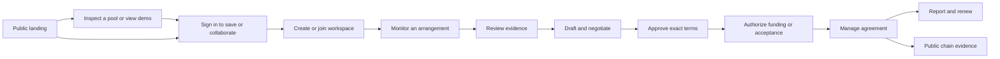

# Mandate: UX, accounts, and workspace plan

Reviewed live at https://mandate-lac-rho.vercel.app/ on 2026-09-26, alongside the local source. The live deployment changed during review: the initial Network page was replaced by the new Overview, Agreements, Reports, and Operator Queue navigation. Recommendations below account for that newer version. Local files were also being edited concurrently. This is a proposed design, not an implemented account system or a new security audit.

## Recommendation

Build one product with three clearly separated surfaces: a public marketing site, a private workspace, and a public evidence explorer. Each person has an account; each organization has a workspace; each agreement has named counterparties and scoped collaboration. Wallets authorize blockchain actions. Connecting a wallet alone is not an authenticated application session.

Success means an issuer can invite an analyst who has no wallet, an operator can work with several clients without mixing their private records, and a treasury signer can review an exact transaction without sharing a private key with either group.

## What the live review found

| Observation | Product consequence | Proposed change |
|---|---|---|
| Strong headline and distinctive period ticks; consistent neutral/green palette | A usable visual identity already exists | Preserve the mark, typography family, and period visualization; improve hierarchy |
| Landing content moves quickly into contract clauses and attack examples | Visitors must understand implementation before seeing daily value | Put a product preview and three-step customer journey above technical detail |
| Updated primary CTA is now “Monitor your current operator” | Better entry point than the old “Open the network” | Preserve it; add Sign in and a separate demo path |
| New Overview offers monitoring and shared drafts | Good workflow foundation | Convert it into a workspace-aware overview with useful first-use and returning-use states |
| “Your agreements” uses the connected issuer/maker wallet | A colleague cannot simply join a team's dashboard | Use workspace membership and agreement associations; retain wallet checks for signing |
| “Nothing yet in this browser” describes reports/drafts | Switching devices or clearing storage loses continuity | Store private records server-side; offer deliberate import of existing local work |
| Current Operational/100% status appears beside an operator's historical D grade | Different scopes look contradictory | Label current agreement compliance and historical operator record separately |
| Detail page combines service levels, book, execution, activity, Jev, management, escrow, and full terms | Reading and acting require a long scan | Use a concise overview and dedicated tabs |
| Several Connect wallet buttons appear on the same detail page | Wallet connection substitutes for explaining next steps | One persistent wallet control; contextual actions explain the required authority |
| New top navigation has seven destinations plus wallet/network controls | Tools and secondary references compete for attention | Desktop sidebar, role-relevant links, secondary Explore section |
| Initial live data can show skeletons while the rest of the page is useful | Users need to distinguish loading from no data | Independent section states, timestamps, bounded loading, retry and partial-data messages |

Visual inspection used the browser's desktop viewport and dark theme. This was not a mobile, keyboard, screen-reader, contrast, or performance certification. Those are explicit acceptance gates below.

## Product surfaces and routes

| Surface | Proposed routes | Access |
|---|---|---|
| Marketing | `/`, `/product`, `/for-operators`, `/security`, `/research` | Public |
| Demo | `/demo` | Public, conspicuous simulated/devnet label; separate persistence |
| Public evidence | `/explore`, `/explore/agreements/[cluster]/[address]`, `/explore/operators/[address]` | Public chain-derived information only |
| Identity | `/sign-in`, `/onboarding`, `/invite/[token]` | Sign-in and invitation flows |
| Workspace entry | `/app` | Resolve signed-in user's last accessible workspace; otherwise sign-in with return destination |
| Workspace | `/app/w/[workspaceId]/overview`, `/agreements`, `/monitoring`, `/reports`, `/tasks` | Verified membership |
| Agreement room | `/app/w/[workspaceId]/agreements/[id]` | Membership plus resource/party access |
| Administration | `/app/w/[workspaceId]/settings/{team,wallets,notifications,security}` | Appropriate permissions |

Workspace subpaths in this table share the full `/app/w/[workspaceId]` prefix. Use one domain initially. Add URL-preserving redirects from current public agreement links to public evidence; do not unexpectedly put previously public chain records behind login. Provide contextual links from evidence into an authorized workspace.



## Landing page design

Design direction: a precise financial operations product with an editorial landing page. The current dark green identity can work; a cosmetic color swap will not fix the missing user journey.

1. **Header:** logo, Product, For operators, Security, Sign in, Start monitoring. Research/source/explorer live in secondary navigation or footer.
2. **Hero:** “Your liquidity agreements. Verified.” Supporting sentence: “Monitor your operator, agree clear terms, and settle service payments with inventory restricted to the agreed market.” Primary: “Monitor an arrangement.” Secondary: “Explore the demo.” A text link serves operators. Keep devnet availability explicit until real-value onboarding is actually available.
3. **Product preview:** a deliberately composed example of an agreement, its latest verified status, and the next action. Use labelled example data, not apparent customer traction. Show the product within the first screen rather than a large area of unused space.
4. **Workflow:** Observe → Agree → Manage and renew. Each step has a real screen fragment and one outcome sentence.
5. **Two-sided benefit:** issuer retains constrained custody and clear evidence; operator gets explicit terms, funded compensation, and a portable factual service record.
6. **Evidence:** a report excerpt, methodology, and a clearly labelled simulated lifecycle. Keep attack demonstrations available but subordinate to the normal successful journey.
7. **Trust and FAQ:** distinguish private collaboration from public transactions, committed liquidity from execution, and observation from guaranteed performance. Describe recovery and limits precisely.
8. **Closing CTA:** repeat Start monitoring. Avoid invented testimonials, customer logos, guaranteed outcomes, or market-size claims from thin-pool statistics.

Use a warm neutral canvas and high-contrast type for long reading, with a forest-green brand area or dark product preview. Preserve an explicit Light/Dark/System preference in the workspace. Green means a verified healthy state; primary actions can use a separate dark brand tone. Price-series colors must not accidentally imply compliance.

## Sign-in and onboarding

Recommended options: **Continue with Google**, **Continue with email** (verification code), and **Continue with Solana wallet**. One account can link several verified sign-in methods. Wallet-only users can start without email; request an address when they choose email alerts or need an email-bound invitation.

A wallet sign-in verifies a message; a wallet connection only exposes an address. Keep Sign in, Connect signing wallet, Approve terms, and Sign transaction as distinct actions with distinct copy. Login must never look like a token approval or fund transfer.

First session:

1. Preserve the pool, draft, or invitation that brought the user in.
2. Choose Create workspace or accept an existing invitation. Ask only workspace name and initial intent: manage our liquidity or provide liquidity services. A solo user gets a one-member workspace, not a separate account model.
3. Offer optional team invitations later. Do not require a wallet, budget, or token deposit to read, draft, or organize records.
4. Continue the intended task. Avoid a generic welcome tour before useful work.
5. Ask for a signing wallet only when authorizing terms or a transaction. Explain which address the contract requires.

Returning users land in their last accessible workspace. Deep links win over the default home. If access was revoked, show a specific explanation and workspace picker; never substitute another team's content under the same URL.

Account linking requires authentication to the existing account plus proof of the new method. Do not merge accounts because their display names or unverified emails match. Wallet disconnect does not silently log out of the account; account sign-out clears private data and subscriptions even if a wallet extension remains connected.

## Workspace and permission model

Person, organization, agreement role, and signing authority are independent concepts. A person may belong to several organizations. A company can issue one agreement and operate another; do not permanently classify a user as “issuer” or “maker” at signup.

| Workspace role | Permissions |
|---|---|
| Owner | Manage ownership, membership, settings, and all workspace records; cannot gain blockchain powers from this role |
| Admin | Manage members and operational settings within explicitly granted limits; cannot promote itself to owner |
| Manager | Create/edit drafts, monitoring jobs, reports, and tasks; invite counterparties to permitted agreement rooms |
| Viewer | Read allowed workspace records and reports; no changes |
| External counterparty | Access only explicitly shared agreement versions, discussion, and selected evidence; no workspace-wide membership implied |

A **signing authority** is an additional verified capability, not a fifth all-powerful workspace role. App permission allows preparing/requesting an operation; the program and transaction signatures determine whether it can execute. Removing a member cannot revoke a blockchain private key they possess. If authority rotation is not supported by the contract, say so rather than implying that a settings switch revokes it.

Two companies negotiate in an agreement room. Each retains private notes and internal approvals. Shared terms, counteroffers, and explicitly shared reports are visible to both. Inviting the operator to one agreement must not reveal unrelated budgets or drafts.

Invitations should be resource/role scoped, expiring, revocable, and accepted by the intended verified identity. Hash bearer tokens at rest. Read-only share links must have an explicit audience, revocation, expiry, and content preview; possession can grant access, so do not call them private authenticated rooms.

Wallet association states: watch-only address, verified linked wallet, authorized signer for this operation. Pasting a treasury address is sufficient to watch public activity, never to claim ownership. A PDA/multisig treasury cannot use an ordinary personal message signature; support its actual authorization workflow before advertising execution support. Personal login should not require possession of the treasury keys.

## Dashboard and screen hierarchy

Use one shell with views appropriate to the workspace and selected work, not separate issuer and operator applications.

Desktop shell: 224–240 px sidebar with workspace switcher, Overview, Agreements, Monitoring, Reports, and Tasks; Operator Queue appears when relevant. Team/settings at the bottom; Explore and help secondary. Top bar: page context, scoped search, notifications, network, and profile. Signing wallet is a separate labelled control when relevant, not the account avatar.

Illustrative issuer wireframe (labels describe layout, not observed customer data):

```text
Workspace ▾       Overview                       Search   Inbox   Profile
                  Devnet workspace · last refreshed …
Overview
Agreements        Needs attention                           New agreement
Monitoring        • Operator proposed revised terms       Review changes
Reports           • Monitoring has a data gap             Inspect coverage
Tasks             • Agreement approaches expiry           Review renewal

                  Active agreements | Fee budget | Monitoring coverage

                  Agreements
                  Market · Operator · Current state · Coverage · Next action

Team              Recent reports                    Recent meaningful events
Settings
Explore
```

Issuer priorities: budget exposure, coverage, proposed changes, service interruptions, renewal dates. Operator priorities: agreements needing action, signing requests, liquidity constraints, bond commitments, and earned fees. An operator workspace may include multiple client relationships, with assignments to its own staff; accessing a client's private workspace still requires explicit permission.

Show 3–4 useful summary values with defined timeframe, scope, mint, and freshness. Replace endless event noise with meaningful changes and an expandable technical log. Never label sampled compliance “uptime” without coverage and a clearly defined denominator. Current agreement results and historical operator performance need separate labels and denominators.

Agreement detail tabs:

- **Overview:** current contract state, latest observation, coverage, next action, short commercial summary.
- **Terms:** plain-language agreement, full clauses, version comparison and approval identities.
- **Liquidity:** committed and executable views with distinct labels, units, reference quality and timestamps.
- **Activity:** incidents and relevant actions, then raw chain evidence on demand.
- **Reports:** service/renewal reports and controlled exports.
- **Access:** participants, permissions and sharing, visible only to authorized managers.

Transaction review is a dedicated panel: workspace, chain, exact signer, operation, tokens/amounts, recipients, fees, and simulation result. States: preparing → awaiting signature → submitted → confirmed/reconciled; rejection, expired transaction, simulation failure, and unknown confirmation outcome are distinct. Preserve the transaction signature and provide status recovery instead of a generic retry that might duplicate an action.

Jev belongs in a contextual “Watchtower assessment” panel: observation time, current/fallback/stale state, evidence links, publisher, and a clearly advisory interpretation. No persistent chatbot column is required. Verified facts remain visually primary.

## Empty, loading, and failure states

- New workspace: one primary next task, “Monitor a market,” plus Draft an agreement. Keep the full populated demo in a separate mode.
- Wallet absent: reading and editing remain available; actions explain the needed signer.
- Wrong signing wallet: show required and connected addresses with Switch wallet; preserve the review state.
- No observations: “Collecting evidence,” with actual progress and coverage requirements. Zero observations is not zero performance.
- Partial or stale RPC data: retain last-known data with its timestamp; show unavailable fields explicitly.
- No workspace access: no flash of another organization's cached content; clear private caches/subscriptions on account or workspace change.
- Browser-only observation: explicitly show “Runs while this tab is open.” Background monitoring requires a durable worker, not account login alone.
- Invite expired/revoked: explain and offer request-new-invite guidance without exposing private record contents.
- Concurrent draft edits: preserve versions, surface conflicts, and invalidate approvals when exact approved terms change.

## Visual system and responsive behavior

- Retain Chivo and Chivo Mono initially; use mono selectively for numbers/addresses. Use approximately 16 px body text, 14 px table text, and avoid 10–11 px essential explanations.
- Establish an 8 px spacing rhythm, restrained 8–12 px control radii, 48–64 px marketing section gaps, and clear surface boundaries. Reduce nested card-on-card layouts.
- Landing page uses generous composition; workspace uses compact, aligned rows. Give one primary action per screen or task stage.
- Preserve period ticks as the distinctive motif, with keyboard/touch-selectable summaries. Explain Met/Missed/Unobserved without relying on red/green alone.
- Mobile: collapsible navigation, stacked attention items, concise agreement rows, dedicated detail pages for complex comparisons, and a sticky review action that does not obscure content. Keep all capabilities accessible, including signing where the wallet supports it.
- Target 44 px touch controls; verify WCAG AA contrast, visible focus, labelled controls, focus restoration, reduced motion, and 200% zoom. A tooltip must not be the only access to material financial terms.
- Stable layout during loading, bounded skeletons, responsive filters/search, and preserved return position. Prioritize summary data over historical feeds to reduce initial load.

## Management and backend design

Use a managed identity service and a relational application database. The Vercel Marketplace authentication/storage discovery was run read-only; Clerk and Neon are available. Recommendation: Clerk for sign-in/organizations and managed Postgres such as Neon for product records. Validate provider plans and required organization features before provisioning. No providers, credentials, billing, or deployments were created by this review.

Clerk documents [Solana sign-in and linking](https://clerk.com/docs/guides/configure/auth-strategies/web3/solana) and [organization memberships](https://clerk.com/docs/guides/organizations/overview). These supply identity primitives; they do not implement Mandate's agreement permissions or grant transaction authority.

Persist users, workspaces, memberships, wallet proofs/associations, agreement-party links, draft versions, approvals, observation jobs, report snapshots, invitations, notifications, and audit events. Keep chain addresses keyed by cluster/program/address. Store money in raw integer units plus mint identity. Identity provider owns credentials; application owns product records; Solana owns authoritative contract/fund state.

Check membership, resource scope, and operation permissions on every private read/write in a server-side data-access layer, including exports, jobs, downloads and subscriptions. Route hiding is insufficient; this matches the [Next.js authentication guidance](https://nextjs.org/docs/app/guides/authentication). Scope caches to workspace/user/resource/version; do not cache private responses publicly. An explicit workspace URL must be checked against the authenticated identity rather than trusted as authority.

Background requests need explicit validated workspace context. Clerk's organization documentation warns about multi-tab active-organization context: a global cookie alone is insufficient for background requests from different organization tabs. Follow its per-tab token guidance and test both tabs concurrently.

Record who invited, changed, approved, shared, funded, or requested an operation. Keep human approvals, wallet signatures, and chain confirmations separately auditable. Authenticate service workers with scoped service credentials rather than a user's browser session; recheck applicable permissions when jobs execute.

Administrative UI should include team/invitations, linked/watch-only wallets, notification preferences, session security, and audit history. Internal platform support gets a separate restricted console. Support staff must not silently impersonate signers or obtain transaction authority.

Private drafts, comments, email identities, and internal reports stay private by default. Public chain activity remains public irrespective of login. Deleting a workspace cannot delete blockchain history. Report publication requires an explicit preview of what becomes public.

## Migration from the current work

Keep the new monitoring, draft, feasibility, operator, and renewal logic. Introduce a persistence boundary around `app/src/lib/local.ts`; do not rewrite the financial logic for the redesign. Guest browser storage remains an explicitly temporary scratchpad.

After sign-in, offer “Import work from this browser” with a list and destination workspace. Validate formats and signature evidence, deduplicate by stable IDs/version hashes, record local-data provenance, and never silently treat imported signatures as current workspace membership or authority. Clear account-scoped sensitive state on logout. For a shared computer, import must be deliberate rather than automatic.

Replace document-containing draft links with server-held versioned records and revocable scoped invitations for authenticated collaboration. Existing exported documents remain importable; their original links cannot be retroactively made private or revoked. Once shared, downloaded copies cannot be recalled.

Move durable monitoring out of `observer.ts`'s tab lifecycle into background jobs before promising continuous monitoring. Preserve browser-only monitoring as a clearly labelled guest option or remove it from the production promise. Job budgets and deduplication must prevent several viewers from multiplying observation work.

## Build order and acceptance gates

1. **Identity and persistence:** real sign-in, workspace creation/switcher, server-side membership checks, database-backed drafts/reports, wallet linking and migration. Gate: two users in one team share the same records across devices; another team cannot access them through URLs, APIs, exports, or cached responses.
2. **Application shell and three primary journeys:** issuer overview, operator queue, agreement room. Gate: a walletless teammate can prepare a draft; the signer reviews identical terms; the counterparty sees only explicitly shared content.
3. **Collaboration and background work:** versioned invitations, draft conflicts, durable observation jobs, audit trail, preferences. Gate: tab closure does not stop paid monitoring; revocation takes effect; a retry does not duplicate a financial action or observation job.
4. **Landing and visual refinement:** product preview, customer-oriented content, consistent components, mobile, accessibility. Gate: five representative users can identify who the product is for, start their task, locate required actions, and distinguish demo/public/private data without guidance.

Test cases include two organizations in separate tabs, wallet A linked to account B only after proof, removal of a member with an active session, expired invitation, invalid share token, workspace switching during an in-flight request, revoked download access, shared draft version conflict, unsupported multisig, lost session during transaction confirmation, RPC failure, and mobile wallet cancellation.

Measure time to first saved observation, onboarding completion, invite acceptance, first shared draft, successful signer handoff, completed report, repeat workspace use, and renewal. Use consenting real workflows; simulated users are not acquisition or retention evidence.

The first design milestone is a convincing end-to-end flow for one issuer, one colleague, and one external operator. A separate launchpad console, marketplace, enterprise SSO, billing system, or autonomous transaction agent can wait until its workflow is demonstrated necessary.
